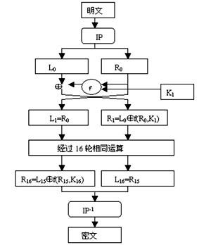

# 

[TOC]

# DES算法设计

## 1、原理概述

DES（Data Encryption Standard）数据加密标准，是一种使用对称密钥的加密算法，即加密和解密使用同样的密钥，由1972年美国IBM公司研制。

DES是一种典型的块密码—一种将固定长度的明文通过一系列复杂的操作变成同样长度的密文的算法。对DES而言，块长度为64位。密钥表面上是64位的，然而只有其中的56位被实际用于算法，其余8位（第8、16、24、32、40、48、56、64位是校验位， 使得每个密钥都有奇数个1）可以被用于奇偶校验，并在算法中被丢弃。因此，DES的有效密钥长度仅为56位。

## 2、总体结构


1. 首先将初始64位明文进行IP（初始置换）。
2. 然后将输出分成两个32位的半块，进行16次相同的回次（round）处理过程，这种交叉方式称为Feistel结构。
3. 每次处理使用一次“F函数”，它将32位数据半块与某个子密钥进行处理。然后，一个F函数的输出与另一个32位半块异或之后，再与原本的半块组合并交换顺序，进入下一个回次的处理。在最后一个回次完成时，两个半块需要交换顺序，这是费斯妥结构的一个特点，以保证加解密的过程相似。
4. 最后进行FP（终止置换），它是IP的反函数，即撤销IP的操作。




## 3、模块分解

### 1、初始置换


将输入的 64 位明文重新进行排序，即将第 58 位放到第 1 位，第 50 位放到第 2 位……以此类推。初始置换以后得到的是一个 64 位的输出。终止置换根据尾置换表进行排序。


### 2、 子密钥 Ki 的获取

- 首先将64位密钥去掉了奇偶校验位变为56位，同时根据置换表进行排序。
- 然后将前28位 C0 和后28位 D0，分别对它们进行循环左移（在第1,2,9,16轮时循环左移一位，其余轮数时循环左移两位），C0 左移得到 C1，D0 左移得到 D1。
- 将 C1 和 D1 合并成 56 位，然后进行压缩置换，得到当前这一轮的 48 位子密钥 K1 。
- 然后对 C1 和 D1 进行左移和压缩置换，获取下一轮的子密钥……一共进行16轮，得到 16 个 48 位的子密钥。


### 3、S盒压缩


费斯妥函数（F函数）的过程。其每次对半块（32位）进行操作，并包括四个步骤：

1. **扩展置换**：通过表 E 将32位的半块扩展到48位，其输出包括8个6位的块，每块包含4位对应的输入位，加上两个邻接的块中紧邻的位。

2. **与密钥混合**—用异或操作将扩张的结果和一个**子密钥**Ki进行混合。16个48位的子密钥（每个用于一个回次的F变换）

3. **S盒**—在与子密钥混合之后，块被分成8个6位的块，然后使用“S盒”，或称“置换盒”进行处理。8个S盒的每一个都使用以查找表方式提供的非线性的变换将它的6个输入位变成4个输出位。**S盒提供了DES的核心安全性—如果没有S盒，密码会是线性的，很容易破解。**

   **具体的S盒置换过程如下**：输入分为8组6位，把 6 位输入中的第 1 位和第 6 位取出来行成一个两位的二进制数 x并转换为十进制 ，作为 Si 表中的行数（0~3）；把 6 位输入的中间 4 位构成另外一个二进制数 y并转换为十进制，作为 Si 表的列数（0~15）；查出 Si 表中 x 行 y 列所对应的整数，将该整数转换为一个 4 位的二进制数，作为4位输出。

4. **置换**—最后，S盒的32个输出位利用固定的置换，“P置换”进行重组。这个设计是为了将每个S盒的4位输出在下一回次的扩张后，使用4个不同的S盒进行处理。


### 4、终止置换FP

​	初始置换IP的逆操作


## 4、数据结构

本次实验采用二维数组存放置换表，三维数组存放8个S盒置换表。使用c++STL中的bitset存储二进制数据和密钥。


## 5、C++语言算法过程

具体有三个关键函数：

1. 对56位密钥的前后28位C0和D0进行循环左移
2. 16个子密钥生成
3. Feistel 轮函数，接收32位数据和48位子密钥，产生一个32位的输出   

### 1、循环左移

```c++
//对56位密钥的前后28位C0和D0进行循环左移
bitset<28> leftShift(bitset<28> keys, int shift_bit)
{
	bitset<28> tmp = keys;
	for(int i=27; i>=0; i--)
	{
		if(i-shift_bit<0)
			keys[i] = tmp[i-shift_bit+28];//末位到高位
		else
			keys[i] = tmp[i-shift_bit]; 
	}
	return keys;
}
```

### 2、生成子密钥

```c++
//16个子密钥生成
void generateSubKeys() 
{
	bitset<56> originKey; //初始密钥
	bitset<48> compressedKey; //压缩后的密钥
	bitset<28> left;
	bitset<28> right;

	// 进行PC_1置换，去掉奇偶标记位，将64位密钥变成56位
	for (int i=0; i<8; i++){
		for(int j=0;j<7;j++)
			originKey[55-i*8-j] = key[64 - PC_1[i][j]];
	}

	// 生成子密钥，保存在 subKeyss[16] 中
	for(int round=0; round<16; ++round) 
	{
		// 分离前28位与后28位
		for(int i=28; i<56; ++i)
			left[i-28] = originKey[i];
		for(int i=0; i<28; ++i)
			right[i] = originKey[i];

		// 左移
		left = leftShift(left, leftShiftBits[round]);
		right = leftShift(right, leftShiftBits[round]);

		// 合并成56位
		for(int i=28; i<56; ++i)
			originKey[i] = left[i-28];
		for(int i=0; i<28; ++i)
			originKey[i] = right[i];

		// 进行PC_2压缩置换，由56位得到48位子密钥
		for(int i=0; i<8; i++){
			for(int j=0;j<6;j++)
				compressedKey[47-i*8-j] = originKey[56 - PC_2[i][j]];
		}

		//保存子密钥
		for(int i=0;i<48;i++)
			subKeys[round][i] = compressedKey[i];
	}
}
```

### 3、Feistel 轮函数

```c++
// Feistel 轮函数，接收32位数据和48位子密钥，产生一个32位的输出            
bitset<32> feistel(bitset<32> R, bitset<48> subkey)
{
	bitset<48> expand_R;

	// 第一步：E-扩展，32 -> 48
	for(int i=0; i<8; i++){
		for(int j=0;j<6;j++)
			expand_R[47-i*8-j] = R[32-E[i][j]];
	}

	// 第二步：与子密钥异或
	expand_R = expand_R ^ subkey;

	// 第三步：查找S_BOX置换表索引
	bitset<32> result;
	int x = 0,msb=0,lsb=0;

	// 每6位进行一次查找，输出4位，总共8次查找
	for(int i=0; i<8; i++)
	{	
		// 第一位和最后一位组成的二进制数转换成十进制数字为S盒置换表行数	
		msb = expand_R[47-i*6];
		lsb = expand_R[47-i*6-5];
		int row = msb*2 + lsb;

		//	中间4位组成的二进制数转换成十进制数字为S盒置换表列数
		int other_bits[4];
		for(int j=0;j<4;j++){
			other_bits[j] = expand_R[47-i*6-j-1];
		}
		int col = 0;
		for(int j=0;j<4;j++){
			col += other_bits[j]*pow(2.0,3-j);
		}

		// 索引表项
		int num = S_BOX[i][row][col];

		// 转换成二进制
		bitset<4> binary(num);
	
		result[31-x] = binary[3];
		result[31-x-1] = binary[2];
		result[31-x-2] = binary[1];
		result[31-x-3] = binary[0];
		x += 4;
	}

	// 第四步：P-置换，32 -> 32
	bitset<32> tmp = result;
	for(int i=0; i<8; i++){
		for(int j=0;j<4;j++)
			result[31-i] = tmp[32-P[i][j]];
	}
	return result;
}
```

### 4、DES完整加密函数

```c++
//DES完整加密
//输入：64位二进制明文
//输出：64位二进制密文
bitset<64> encrypt(bitset<64>& plain)
{
	bitset<64> cipher;
	bitset<64> currentBits;
	bitset<32> left;
	bitset<32> right;
	bitset<32> newLeft;

	// 第一步：初始置换IP
	for(int i=0; i<8; i++){
		for(int j=0 ; j<8 ;j++)
			currentBits[63-i*8-j] = plain[64-IP[i][j]];
	}	

	// 第二步：获取 Li 和 Ri
	for(int i=32; i<64; ++i)
		left[i-32] = currentBits[i];
	for(int i=0; i<32; ++i)
		right[i] = currentBits[i];

	// 第三步：共16轮迭代
	for(int round=0; round<16; ++round)
	{
		newLeft = right;
		right = left ^ feistel(right,subKeys[round]);
		left = newLeft;
	}

	// 第四步：合并L16和R16，最后转换为R16L16
	for(int i=0; i<32; ++i)
		cipher[i] = left[i];
	for(int i=32; i<64; ++i)
		cipher[i] = right[i-32];

	// 第五步：终止置换FP
	currentBits = cipher;
	for(int i=0; i<8; i++){
		for(int j=0;j<8;j++)
			cipher[63-i*8-j] = currentBits[64-FP[i][j]];
	}

	// 返回密文
	return cipher;
}
```

### 5、DES完整解密（子密钥逆序应用）

```c++
//DES完整解密
//输入：64位二进制密文
//输出：64位二进制明文
bitset<64> decrypt(bitset<64>& cipher)
{
	bitset<64> plain;
	bitset<64> currentBits;
	bitset<32> left;
	bitset<32> right;
	bitset<32> newLeft;

	// 第一步：初始置换IP
	for(int i=0; i<8; i++){
		for(int j=0 ; j<8 ;j++)
			currentBits[63-i*8-j] = cipher[64-IP[i][j]];
	}	

	// 第二步：获取 Li 和 Ri
	for(int i=32; i<64; ++i)
		left[i-32] = currentBits[i];
	for(int i=0; i<32; ++i)
		right[i] = currentBits[i];

	// 第三步：共16轮迭代（子密钥逆序应用）
	for(int round=0; round<16; ++round)
	{
		newLeft = right;
		right = left ^ feistel(right,subKeys[15-round]);
		left = newLeft;
	}

	// 第四步：合并L16和R16，注意合并为 R16L16
	for(int i=0; i<32; ++i)
		plain[i] = left[i];
	for(int i=32; i<64; ++i)
		plain[i] = right[i-32];

	// 第五步：结尾置换FP
	currentBits = plain;
	for(int i=0; i<8; i++){
		for(int j=0;j<8;j++)
			plain[63-i*8-j] = currentBits[64-FP[i][j]];
	}

	// 返回明文
	return plain;
}
```

### 6、主函数（文件读写）

当明文不足8字节整数倍的时候，将补齐空格字符，然后每64位使用同样的密钥加密。

```c++
int main() {
    //要加密的明文
	string s = "Hello, My name is Bob.";
    //设置的初始密钥
	string k = "12345678";
	
    //记录块数
	int block_num = 0;
    //不足8字节整数倍，补齐空格字符
	while(s.size()%8!=0){
		s.append("\n");
	}
    
	block_num = s.size()/8;
	
    //将密钥转换为64位二进制数
	key = char2Bit(k.c_str());		
	// 生成16个子密钥
	generateSubKeys();   

	// 每块密文以二进制方式追加写入 cipher.txt	
	fstream f("cipher.txt", ios::binary | ios::out | ios::app);	
	for(int i=0 ;i<block_num;i++){	
        //每64位截取一个子串
		string sub_string = s.substr(i*8,8);
         //将明文转换为64位二进制数
		bitset<64> plain = char2Bit(sub_string.c_str());
        //使用DES加密
		bitset<64> cipher = encrypt(plain);
        //追加写入ciper.txt
		f.write((char*)&cipher,sizeof(cipher));
	}
	f.close();
 
	// 以二进制读文件 cipher.txt
	fstream fin("cipher.txt", ios::binary | ios::in);
	fstream fout("plain.txt", ios::binary | ios::out | ios::app);
	for(int i=0;i<block_num;i++){
        //文件指针定位每块密文的起始处
		fin.seekp(i*8);
		bitset<64> temp;
		fin.read((char*)&temp, sizeof(temp));
		// 解密，并写入文件 plain.txt
		bitset<64> decipher = decrypt(temp);
		fout.write((char*)&decipher,sizeof(decipher));
	}
	fin.close();
	fout.close();
 
	return 0;
}
```

## 6、编译运行结果

设置明文和密钥


加密后的密文


对密文使用DES对称解密得到的明文

