# MD5

[github仓库](https://github.com/hansenbeast/Web-Security-Course/tree/master/Assignment%202)

## 算法原理概述

MD5 使用 little-endian (小端模式)，输入任意不定长度信息，以 512-bit 进行分组，生成四个32-bit 数据，最后联合输出固定 128-bit 的信息摘要。

这种不可逆的哈希算法一般用于一致性验证，如典型的数字签名和MD5校验。

## 总体结构

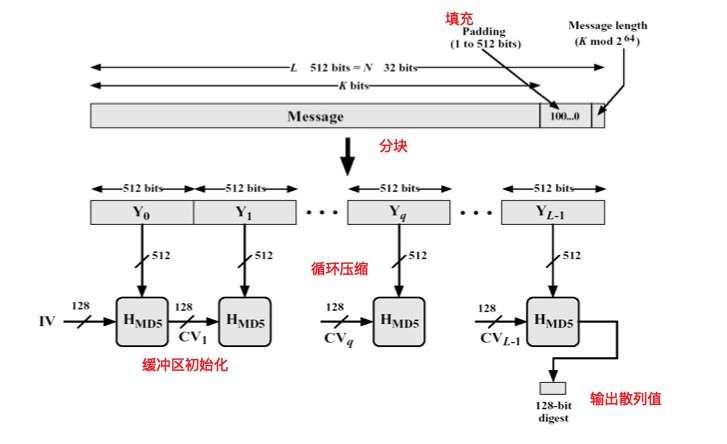

## 模块分解

### 1. 填充和分组

对长度为 K bits 的原始消息数据补位，设补位后信息的长度为LEN(bit)，则LEN%512 = 448(bit)，即数据扩展至 K * 512 + 448(bit)。即K * 64+56(byte)，K为整数。补位操作始终要执行，如果补位前信息的长度对512求余的结果是448，则补512位。

具体补位操作：补一个1，然后补0至满足上述要求。总共最少要补1bit，最多补512bit。

再向上述填充好的消息尾部附加 K 值的低64位 (即 K mod 2^64 )， 最后得到的数据长度是16个字(32byte)的整数倍。

把填充后的消息结果分割为 L 个 512-bit 分组：Y0，Y1，...，YL-1，

分组结果也可表示成 N 个32-bit 字：M0，M1，...，MN-1，N=L*16


### 2. 初始化

初始化一个128-bit 的 MD 缓冲区，记为 CVq ，表示成4个32-bit 寄存器 (A, B, C, D)；CV0 = IV。迭代在 MD 缓冲区进行，最后一 步的128-bit 输出即为算法结果。

初始化使用的是十六进制表示的数字，注意低字节在前： 

word A: 01 23 45 67 

word B: 89 ab cd ef 

word C: fe dc ba 98 

word D: 76 54 32 10


### 3. 总控流程

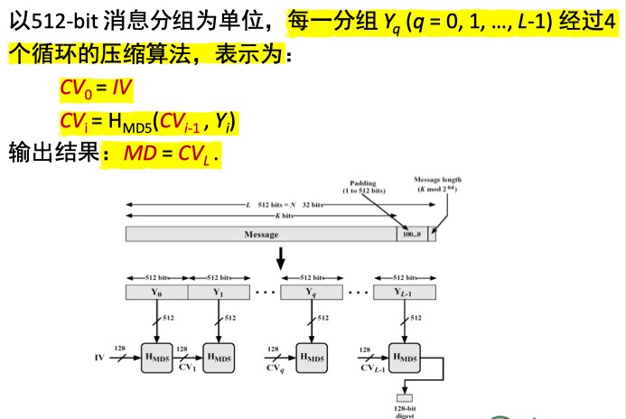

Hmd5从CV输入128位，从消息分组输入512位，完成4轮循环后，输出128位，用于下一轮输入的 CV 值。

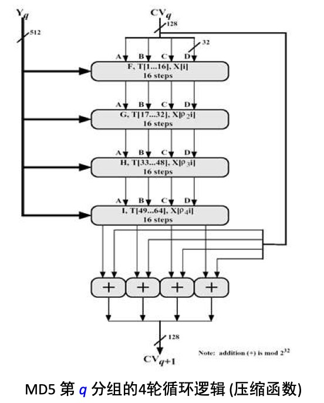

每轮循环分别固定不同的生成函数F, G, H, I，结合指定的T表元素T[]和消息分组的不同部分X[] 做16次迭代运算，生成下一轮循环的输入。4轮循环总共有64次迭代运算。


### 4. 压缩函数

4轮循环中使用的生成函数 (轮函数) g 是一个32位非线性逻辑函数

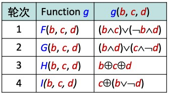

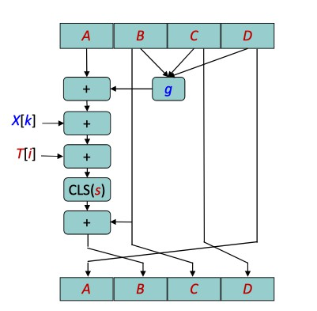

-  g : 轮函数 (F, G, H, I 中的一个)。  

- <<<s : 将32位输入循环左移 (CLS) s 位。 
- X[k] : 当前处理消息分组的第 k 个 (k = 0..15) 32位字。
- T[i] : T 表的第 i 个元素，32位字；T表总共有64个元素，也称为加法常数。
- +: 模 2^32 加法。


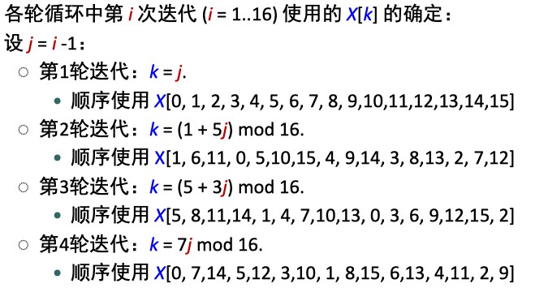

T 表的生成：

T[i] = int(2^32 *abs(sin(i)) 

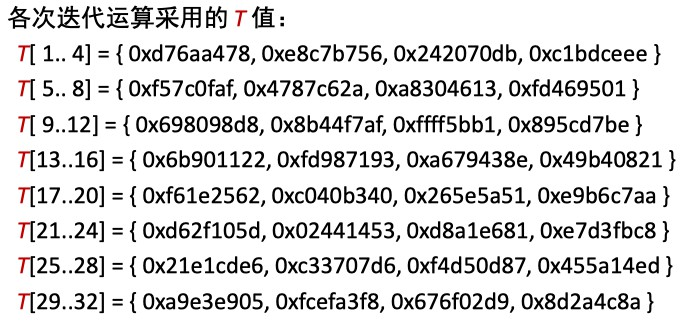

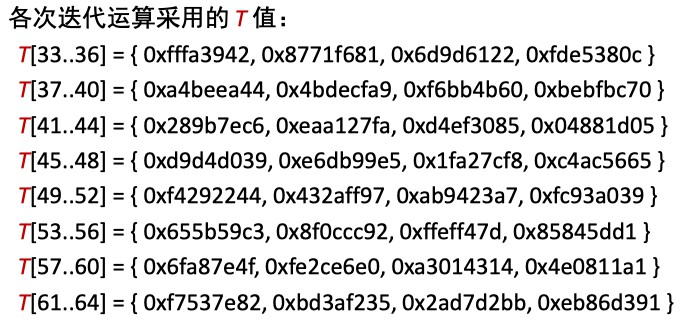

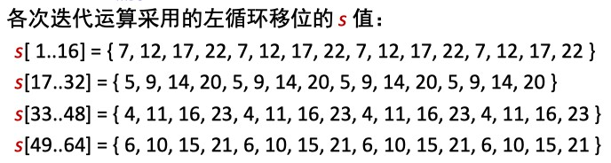


## 数据结构与c++源码

定义MD5类，其中的私有成员变量有：

1. 128位的缓冲区，每32位用unsigned int类型保存，

   `vector<unsigned int> md;`

2. padding后的消息

   `unsigned char* buffer;`

3. padding后的消息的长度

   `unsigned int buffer_len;`


私有函数有：

1. 将原始信息填充

   `void padding(string plain);`

2. 清除buffer

   `void clear();`

3. 压缩函数（对每一个512bits的分组）

   `void h_md5(int groupid);`

4. 4个轮函数

   ```c++
   // a,b,c,d为MD缓冲区的4个32-bit寄存器
   // X为当前处理消息分组中的32字节
   // s为循环左移位数
   // t为T表元素
   unsigned int FF(unsigned int a,unsigned int b, unsigned int c, unsigned int d,unsigned int X,unsigned int s,unsigned int t);
   
   unsigned int GG(unsigned int a,unsigned int b, unsigned int c, unsigned int d,unsigned int X,unsigned int s,unsigned int t);
   
   unsigned int HH(unsigned int a,unsigned int b, unsigned int c, unsigned int d,unsigned int X,unsigned int s,unsigned int t);
   
   unsigned int II(unsigned int a,unsigned int b, unsigned int c, unsigned int d,unsigned int X,unsigned int s,unsigned int t);
   ```

5. 循环左移（返回 val 循环左移　bits 位的值）

   `unsigned int rotate_left(unsigned int val, unsigned int bits);`

6. 获得当前消息分组的第 k 个 (k = 0..15) 32位字。（返回第 round 轮迭代中，第 step步的 X 对应下标）

   `int get_x_index(int round, int step);`

7. 返回 buffer 中 [pos, pos + 3] 四个字节按照 little-endian 组成的 X

    `unsigned int uchar2uint(int pos);`

8. 返回 unsigned char 对应的十六进制 string

   `string uchar2hex(unsigned char uch);`


公有函数除构造函数和析构函数外有：

1.  获得128位的信息摘要

   string getDigest(string plain);


T表元素用二维数组常量表示

```c++
// T表
const int T[] = {
    0xd76aa478,0xe8c7b756,0x242070db,0xc1bdceee,
    0xf57c0faf,0x4787c62a,0xa8304613,0xfd469501,
    0x698098d8,0x8b44f7af,0xffff5bb1,0x895cd7be,
    0x6b901122,0xfd987193,0xa679438e,0x49b40821,
    0xf61e2562,0xc040b340,0x265e5a51,0xe9b6c7aa,
    0xd62f105d, 0x2441453,0xd8a1e681,0xe7d3fbc8,
    0x21e1cde6,0xc33707d6,0xf4d50d87,0x455a14ed,
    0xa9e3e905,0xfcefa3f8,0x676f02d9,0x8d2a4c8a,
    0xfffa3942,0x8771f681,0x6d9d6122,0xfde5380c,
    0xa4beea44,0x4bdecfa9,0xf6bb4b60,0xbebfbc70,
    0x289b7ec6,0xeaa127fa,0xd4ef3085, 0x4881d05,
    0xd9d4d039,0xe6db99e5,0x1fa27cf8,0xc4ac5665,
    0xf4292244,0x432aff97,0xab9423a7,0xfc93a039,
    0x655b59c3,0x8f0ccc92,0xffeff47d,0x85845dd1,
    0x6fa87e4f,0xfe2ce6e0,0xa3014314,0x4e0811a1,
    0xf7537e82,0xbd3af235,0x2ad7d2bb,0xeb86d391
};
```


关键函数：

1. 总体结构

```c++
string MD5::getDigest(string plain) {
    // 回收buffer和缓冲区md
    clear();
    // 初始化缓冲区
    md.push_back(0x67452301);
    md.push_back(0xefcdab89);
    md.push_back(0x98badcfe);
    md.push_back(0x10325476);
    // 填充扩展
    padding(plain);

    // 获得总组数
    int group_len = buffer_len / 64;

    // 对每组进行压缩并迭代
    for (int i = 0; i < group_len; ++i) 
        h_md5(i);

    // 返回16进制字符串
    return md2str();
}
```

2. 填充

```c++
// 填充 padding 和 length
void MD5::padding(string plain) {

    unsigned int plain_len = plain.size();
    // 原始信息位数K
    unsigned long long K = plain.size() * 8;
    // padding位数P
    unsigned int P = K % 512 == 448 ? 512 : (960 - K % 512) % 512;

    unsigned int fill_len = P / 8;
    
    // padding后的信息字节数
    buffer_len = plain_len + fill_len + 8;
    buffer = new unsigned char[buffer_len];

    // 复制原始消息
    for (int i = 0; i < plain_len; ++i) 
        buffer[i] = plain[i];

    // padding，按照100...的格式
    buffer[plain_len] = 0x80;
    for (int i = 1; i < fill_len; ++i) 
        buffer[plain_len + i] = 0;

    // 填充原始消息
    for (int i = 0; i < 8; ++i) {
        unsigned char ch = K;
        buffer[plain_len + fill_len + i] = ch;
        K >>= 8;
    }
}
```

3. 每个分组进行4轮，每轮16次的迭代，更新md缓冲区

```c++
// 压缩函数
// 传入分组序号，从0开始，每64字节一组
void MD5::h_md5(int groupid) {

    int buff_begin = 64 * groupid;

    // 迭代输出
    unsigned int next;

    // 128位缓冲区
    vector<unsigned int> last_md(md);
	
    // 循环左移位数
    const unsigned int rotate_left_bits[4][4] = {
        {7, 12, 17, 22},
        {5, 9, 14, 20},
        {4, 11, 16, 23},
        {6, 10, 15, 21}
    };

    // round = [0, 1, 2, 3] 分别对应 [F, G, H, I] 4轮
    for (int round = 0; round < 4; round++) {
        // 每轮迭代次数
        for (int iter = 0; iter < 16; iter++) {
            // 每轮循环中的一次迭代运算逻辑

            // 当前处理消息分组的第 k 个 (k = 0..15) 32位字
            unsigned int X = uchar2uint(buff_begin + get_x_index(round, iter) * 4);
            // T 表的第 i 个元素，32位字
            // unsigned int t = 0x100000000UL * abs(sin(round * 16 + i + 1));
            unsigned int t = T[round*16+iter];

            switch(round){
                case 0:
                    next = FF(md[0], md[1], md[2], md[3], X, rotate_left_bits[round][iter % 4], t);
                    break;
                case 1:
                    next = GG(md[0], md[1], md[2], md[3], X, rotate_left_bits[round][iter % 4], t);
                    break;
                case 2:
                    next = HH(md[0], md[1], md[2], md[3], X, rotate_left_bits[round][iter % 4], t); 
                    break;
                case 3:
                    next = II(md[0], md[1], md[2], md[3], X, rotate_left_bits[round][iter % 4], t);
                    break;
            }   

            // 缓冲区 (A, B, C, D) 作循环轮换
            md[0] = md[3];
            md[3] = md[2];
            md[2] = md[1];
            md[1] = next;
        }
    }
    // 得到最后一次迭代的结果和初始CV的相加
    for (int i = 0; i < 4; ++i) 
        md[i] += last_md[i];
}
```

4. 轮函数

```c++
// 4 个轮函数
unsigned int MD5::FF(unsigned int a,unsigned int b, unsigned int c, unsigned int d,unsigned int X,unsigned int s,unsigned int t){
    unsigned int g = (b & c) | (~b & d) ;
    unsigned int res = a + g + X + t;
    return  rotate_left(res,s) + b;
}
unsigned int MD5::GG(unsigned int a,unsigned int b, unsigned int c, unsigned int d,unsigned int X,unsigned int s,unsigned int t){
    unsigned int g = (b & d) | (c & ~d);
    unsigned int res = a + g + X + t;
    return  rotate_left(res,s) + b;
}
unsigned int MD5::HH(unsigned int a,unsigned int b, unsigned int c, unsigned int d,unsigned int X,unsigned int s,unsigned int t){
    unsigned int g =  b ^ c ^ d;
     unsigned int res = a + g + X + t;
    // res = rotate_left(res + a,s);
    return  rotate_left(res,s) + b;
}
unsigned int MD5::II(unsigned int a,unsigned int b, unsigned int c, unsigned int d,unsigned int X,unsigned int s,unsigned int t){
    unsigned int g = c ^ (b | ~d);
     unsigned int res = a + g + X + t;
    return  rotate_left(res,s) + b;
}
```

5. 获得消息分组的32位字

```c++
// 返回第 round 轮迭代中，第 step　步的 X 对应下标
int MD5::get_x_index(int round, int step) {
    if (round == 0) {
        return step;
    } else if (round == 1) {
        return (1 + 5 * step) % 16;
    } else if (round == 2) {
        return (5 + 3 * step) % 16;
    } else {
        return (7 * step) % 16;
    }
}
```

6. 将每8位转换为16进制字符串

```c++
string MD5::uchar2hex(unsigned char uch) {
    string res;
    unsigned char mask = 0x0F;
    // debug 
    // cout << int(uch) <<endl;
    for (int i = 1; i >= 0; --i) {
        char ch = uch >> (i << 2) & mask;
        // cout << int(ch)<<endl;
        if (ch < 10) 
            ch += '0';
        else 
            ch += 'A' - 10;
        res += ch;
    }

    return res;
}
```


## 编译运行结果

主函数进行简单测试

```c++
#include <iostream>
#include "md5.h"
using namespace std;

int main() {
    MD5 md5;

    string message1 = "How it is going !";
    string digest1 = md5.getDigest(message1);

    string message2 = "!@#$abcd1234! ";
    string digest2 = md5.getDigest(message2);

    cout << "message1: " << message1 << endl;
    cout << "128 bits digest1 in hex: " << digest1 << endl;

    cout << "message2: " << message2 << endl;
    cout << "128 bits digest2 in hex: " << digest2 << endl;
}
```

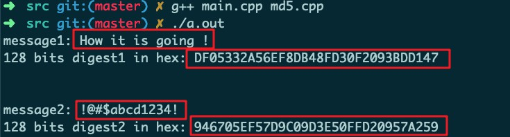


使用在线MD5加密应用进行验证

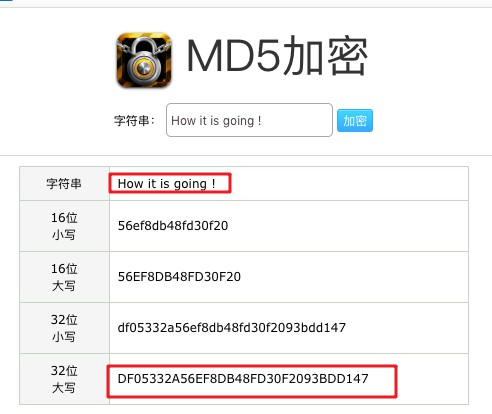

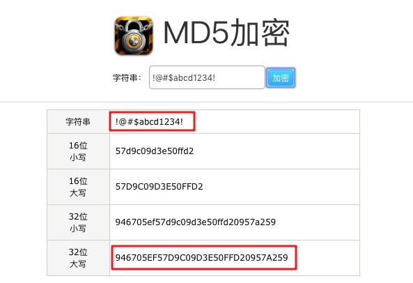

