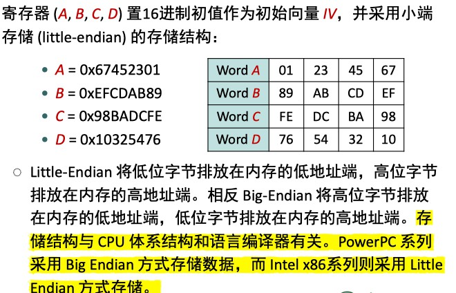

# MD5

## 算法原理概述

MD5 使用 little-endian (小端模式)，输入任意不定长度信息，以 512-bit 进行分组，生成四个32-bit 数据，最后联合输出固定 128-bit 的信息摘要。

## 总体结构

## 模块分解

### 1. 填充和分组

对长度为 K bits 的原始消息数据补位，设补位后信息的长度为LEN(bit)，则LEN%512 = 448(bit)，即数据扩展至 K * 512 + 448(bit)。即K * 64+56(byte)，K为整数。补位操作始终要执行，如果补位前信息的长度对512求余的结果是448，则补512位。

具体补位操作：补一个1，然后补0至满足上述要求。总共最少要补1bit，最多补512bit。

再向上述填充好的消息尾部附加 K 值的低64位 (即 K mod 2^64 )， 最后得到的数据长度是16个字(32byte)的整数倍。

把填充后的消息结果分割为 L 个 512-bit 分组：Y0，Y1，...，YL-1，

分组结果也可表示成 N 个32-bit 字：M0，M1，...，MN-1，N=L*16

### 2. 初始化

初始化一个128-bit 的 MD 缓冲区，记为 CVq ，表示成4个32-bit 寄存器 (A, B, C, D)；CV0 = IV。迭代在 MD 缓冲区进行，最后一 步的128-bit 输出即为算法结果。

初始化使用的是十六进制表示的数字，注意低字节在前： 

word A: 01 23 45 67 

word B: 89 ab cd ef 

word C: fe dc ba 98 

word D: 76 54 32 10

### 3. 总控流程

Hmd5从CV输入128位，从消息分组输入512位，完成4轮循环后，输出128位，用于下一轮输入的 CV 值。

每轮循环分别固定不同的生成函数F, G, H, I，结合指定的T表元素T[]和消息分组的不同部分X[] 做16次迭代运算，生成下一轮循环的输入。4轮循环总共有64次迭代运算。

### 4. 压缩函数

4轮循环中使用的生成函数 (轮函数) g 是一个32位非线性逻辑函数

-  g : 轮函数 (F, G, H, I 中的一个)。  

- <<<s : 将32位输入循环左移 (CLS) s 位。 
- X[k] : 当前处理消息分组的第 k 个 (k = 0..15) 32位字。
- T[i] : T 表的第 i 个元素，32位字；T表总共有64个元素，也称为加法常数。
- +: 模 2^32 加法。

T 表的生成：

T[i] = int(2^32 *abs(sin(i)) 

## 数据结构

## 编译运行结果

