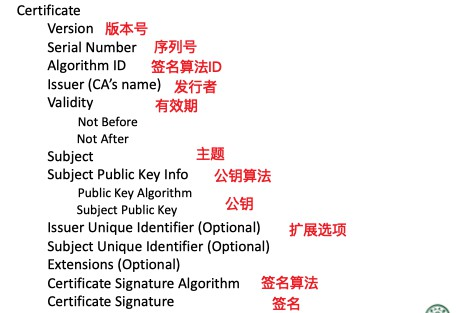
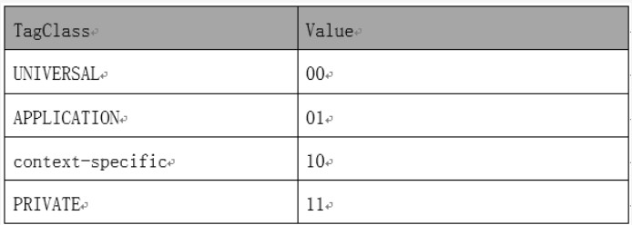
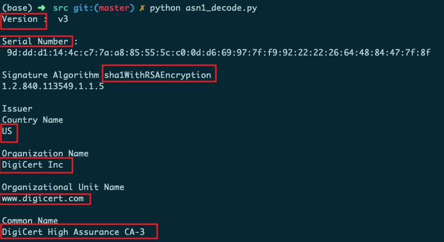
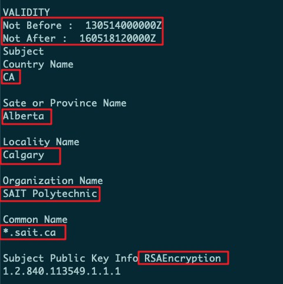
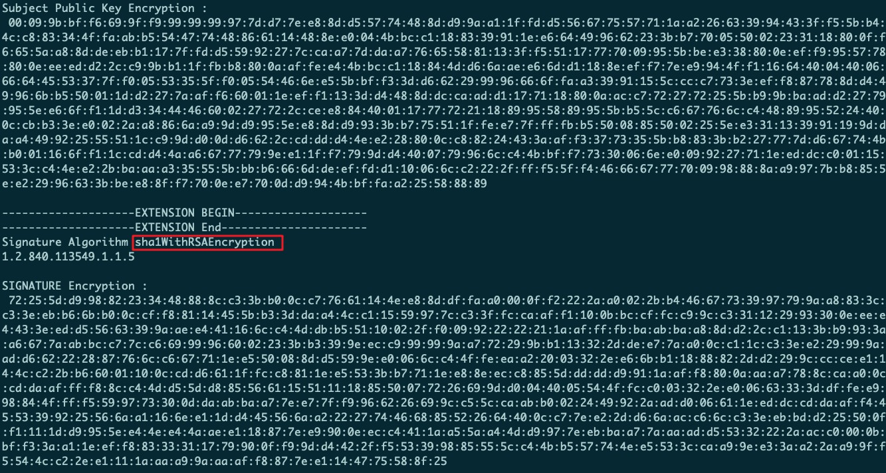
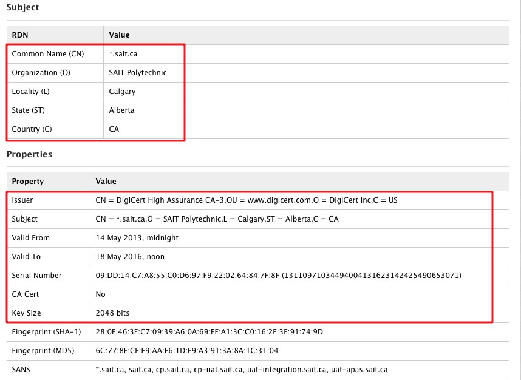

# 实验报告

设计并实现一个小程序，读入一个 X.509 数字证书，按照标准定义给出证书中有关项目的中 (英) 文内容陈述。


## X.509 证书结构描述




## 数据结构

### 一、证书格式

同样的 X.509证书，可能有不同的编码格式。最常见的就是 PEM 和 DER 两种格式。但是有个比较误导人的地方，这两种格式的文件，扩展名不一定就是 `.pem` 或 `.der`，还有其他一些常见格式。它们除了编码格式可能不同之外，内容也有差别。但是大多数都能相互转换编码格式。但两种证书中都没有私钥信息。一般CA使用自己的私钥将证书进行加密，申请证书者可以用CA的公钥对证书进行解密。区别如下：

1. Base64 编码的证书（PEM）

- 包括`BEGIN/END` 声明

- 使用` openssl x509 -in certificate.pem -text -noout`查看 PEM 格式证书的信息


2. 二进制编码的证书（DER）

- 辨别编码规则  DER（Distinguished Encoding Rules）是 ASCII PEM 格式证书的二进制形式。所有类型的证书和私钥都可以被编码为 DER 格式。
- 它是大多数浏览器的缺省格式，并按 ASN1 DER 格式存储。它是无报头的。
- 不包括`BEGIN/END` 声明。
- PEM 是用文本报头包围的 DER。
- 使用` openssl x509 -in certificate.der -inform der -text -noout`查看 DER 格式证书的信息


格式转换：

```bash
openssl x509 -outform der -in certificate.pem -out certificate.der #PEM 转为 DER

openssl x509 -inform der -in certificate.cer -out certificate.pem #DER 转为 PEM
```


### 二、编码规则

二进制DER文件按照**Type-Length-Value**的编码格式存储ANS.1中的数据结构，其中**ANS.1（abstraction notation standard）为抽象符号标准**， 是为了解决高级语言中结构化数据在网络传输中的结构关系能送达目的地进行还原，类似其他几种数据序列化的方法：XML，JSON等，ASN.1本身只定义了表示信息的抽象句法，但是没有限定其编码的方法，本次**解析的是DER编码规则**。


参考：

1. [ASN1 decoder](https://lapo.it/asn1js/#MIIG4TCCBcmgAwIBAgIQCd0Ux6hVwNaX-SICZIR_jzANBgkqhkiG9w0BAQUFADBmMQswCQYDVQQGEwJVUzEVMBMGA1UEChMMRGlnaUNlcnQgSW5jMRkwFwYDVQQLExB3d3cuZGlnaWNlcnQuY29tMSUwIwYDVQQDExxEaWdpQ2VydCBIaWdoIEFzc3VyYW5jZSBDQS0zMB4XDTEzMDUxNDAwMDAwMFoXDTE2MDUxODEyMDAwMFowYDELMAkGA1UEBhMCQ0ExEDAOBgNVBAgTB0FsYmVydGExEDAOBgNVBAcTB0NhbGdhcnkxGTAXBgNVBAoTEFNBSVQgUG9seXRlY2huaWMxEjAQBgNVBAMMCSouc2FpdC5jYTCCASIwDQYJKoZIhvcNAQEBBQADggEPADCCAQoCggEBAJv2n5mZfX6NV0jZof1WdXGiY5Q_W0yDT6tUdIYUjgS8GDkeZJYjtwUCMYD2Wo3rF_1ZJ8p9p2WBP1F3CVvjgO-VeA7tLJsfuAr-S8GE1q5tGO9-lPFkBAZkU38FNfBUblvz1imWb6ORXMc--HjUlrUB0nr2Ae8T1I3K0XGArHJyW5utJ5Xm8dNEYCcs6EAXchiViVtcZ2xIlSQMs-AqhqnZXo2Tt1H-f_tQhQJeMTkZ2kklUcnQ1izdTigMgkOvNzW4Oyd9Z0sBbxzUpneeH3nUB5bEv3MG4JJx7cAVPE4rqjVbtm3v0QbCL_X0ZncJiKl7heKWO-j3DnDZS_oliIkCAwEAAaOCA48wggOLMB8GA1UdIwQYMBaAFFDqc4nbKfsQj57lASDU3nmZSIP3MB0GA1UdDgQWBBTk00KEbrhrTuVWBY2cPzTJd1c1BTBkBgNVHREEXTBbggkqLnNhaXQuY2GCB3NhaXQuY2GCCmNwLnNhaXQuY2GCDmNwLXVhdC5zYWl0LmNhghd1YXQtaW50ZWdyYXRpb24uc2FpdC5jYYIQdWF0LWFwYXMuc2FpdC5jYTAOBgNVHQ8BAf8EBAMCBaAwHQYDVR0lBBYwFAYIKwYBBQUHAwEGCCsGAQUFBwMCMGEGA1UdHwRaMFgwKqAooCaGJGh0dHA6Ly9jcmwzLmRpZ2ljZXJ0LmNvbS9jYTMtZzIxLmNybDAqoCigJoYkaHR0cDovL2NybDQuZGlnaWNlcnQuY29tL2NhMy1nMjEuY3JsMIIBxAYDVR0gBIIBuzCCAbcwggGzBglghkgBhv1sAQEwggGkMDoGCCsGAQUFBwIBFi5odHRwOi8vd3d3LmRpZ2ljZXJ0LmNvbS9zc2wtY3BzLXJlcG9zaXRvcnkuaHRtMIIBZAYIKwYBBQUHAgIwggFWHoIBUgBBAG4AeQAgAHUAcwBlACAAbwBmACAAdABoAGkAcwAgAEMAZQByAHQAaQBmAGkAYwBhAHQAZQAgAGMAbwBuAHMAdABpAHQAdQB0AGUAcwAgAGEAYwBjAGUAcAB0AGEAbgBjAGUAIABvAGYAIAB0AGgAZQAgAEQAaQBnAGkAQwBlAHIAdAAgAEMAUAAvAEMAUABTACAAYQBuAGQAIAB0AGgAZQAgAFIAZQBsAHkAaQBuAGcAIABQAGEAcgB0AHkAIABBAGcAcgBlAGUAbQBlAG4AdAAgAHcAaABpAGMAaAAgAGwAaQBtAGkAdAAgAGwAaQBhAGIAaQBsAGkAdAB5ACAAYQBuAGQAIABhAHIAZQAgAGkAbgBjAG8AcgBwAG8AcgBhAHQAZQBkACAAaABlAHIAZQBpAG4AIABiAHkAIAByAGUAZgBlAHIAZQBuAGMAZQAuMHsGCCsGAQUFBwEBBG8wbTAkBggrBgEFBQcwAYYYaHR0cDovL29jc3AuZGlnaWNlcnQuY29tMEUGCCsGAQUFBzAChjlodHRwOi8vY2FjZXJ0cy5kaWdpY2VydC5jb20vRGlnaUNlcnRIaWdoQXNzdXJhbmNlQ0EtMy5jcnQwDAYDVR0TAQH_BAIwADANBgkqhkiG9w0BAQUFAAOCAQEAcl2YI0iMOwx2FOjfoA8ioCtGc5eag8Prawz4FFs9pMFZfD_K8QvPycMSkw7kPtVjmuQWxNtRAvCSIhr_urqNLBO5Omerx8aZYCOznsmZpymxMt56DBw-KZrWIodsZx5QjVngbE_qIDLmsYgtKczhTCtgEM1h_IHlO3Ho7IXd2Rr4CqeMoM2v-MTV2FYVEYUHJp0EBU_AMuBjPf6YT_WXMNq6fn-WJpxcqwJJKtBh7c2vRTklahbh1FaiJ0aFJkDH4tasbD69JQ8R2V5OSuGH6Q7EGlpNl-unqtUyKsAL86HvgzF5D51C9TmFXEtXTlPKnjoqn1TC4Rqpqvh-FHWPJQ)
2. [ASN1 字段类型](https://nostdahl.com/2017/08/11/x-509-certificates-explained/)


### 三、具体字段

总体嵌套结构：

```
证书总体长度-(4 Bytes)
    -待签名证书-
              -版本号
              -序列号
              -算法标识
              -签发者
              -......
    -签名算法
    -PKCS签名（128 Bytes）
```


1. 之前说过ASN.1以TLV（Tag标签、Length长度、Value值）来表示数据，ASN.1格式中的第一个字节表示了类型，在ASN.1中，有预定义的30种类型，只需要5个bit就够了，剩余的3个bits表示什么呢？

   通常这一个字节被分为了3段。 最高的两位bit[7]和bit[6]表示TagClass，表示这个标签的类



接下来的一位bit[5]是表示这个标签是基本类型（0）还是结构化类型（1），如果是结构化类型的话，后面会再跟一层TVL；最后的5位才是Tag Value。

| Tag Value | Tag类型                    |
| --------- | -------------------------- |
| 1         | BOOLEAN                    |
| 2         | INTEGER                    |
| 3         | BIT STRING                 |
| 4         | OCTET STRING               |
| 5         | NULL                       |
| 6         | OBJECT IDENTIFIER          |
| 7         | ObjectDescripion           |
| 8         | EXTERNAL,INSTANCE OF       |
| 9         | REAL                       |
| 10        | ENUMERATED                 |
| 11        | EMBEDDED PDV               |
| 12        | UFT8String                 |
| 13        | RELATIVE-OID               |
| 14        | 保留                       |
| 15        | 保留                       |
| 16        | ,SEQUENCE OF               |
| 17        | SET,SET OF                 |
| 18        | NumericString              |
| 19        | PrintableString            |
| 20        | TeletexString,T61String    |
| 21        | VideotexString             |
| 22        | IA5String                  |
| 23        | UTCTime                    |
| 24        | GeneralizedTime            |
| 25        | GraphicString              |
| 26        | VisibleString,ISO646String |
| 27        | GeneralString              |
| 28        | UniversalString            |
| 29        | CHARACTER STRING           |
| 30        | BMPString                  |
| 31        | 保留                       |

例如：

DER二进制文件的前4个字节构成具有剩余字节的ASN.1序列。

如`30 82 06 E1`根据Type-Length-Value表示，第一个字节30（00110000）表示是一个universal class type，后面接着一个结构化类型的SEQUENCE。


2. Length长度字段，有两种编码格式。

- 若长度值小于等于127，则用一个字节表示，bit8 = 0, bit7-bit1 存放长度值；
- 若长度值大于127，则用多个字节表示，可以有2到127个字节。第一个字节的第8位为1，其它低7位给出后面该域使用的字节的数量，从该域第二个字节开始给出数据的长度，高位优先。
- 还有一种特殊情况，这个字节为0x80，表示数据块长度不定，由数据块结束标识结束数据块

继续之前的例子：

如`30 82 06 E1`根据Type-Length-Value表示，第二个字节82（10000010）表示长度值大于127，且长度值用后面两个字节表示，06 E1表示1761为长度值。

```python
def parse_Length(nextByte):
    length = 0
    # 大于127，则用多个字节表示，可以有2到127个字节
    if nextByte > 0x80: 
        nextByte -= 0x80
        for i in range(nextByte):
            length *= 256
            length += ord(f.read(1))
    # 小于等于127，则用一个字节表示
    else:
        length = nextByte
    return length
```


3. Value数据块字段：存放数据块的值，具体编码随数据块类型不同而不同

4. 数据块结束标识（可选），结束标示字段，两个字节（0x0000）,只有在长度值为不定时才会出现。


**证书中具体的数据结构**（From RFC 5280）

```
Certificate ::= SEQUENCE {
 tbsCertificate TBSCertificate,
 signatureAlgorithm AlgorithmIdentifier,
 signatureValue BIT STRING }
 
TBSCertificate  ::=  SEQUENCE  {
    version         [0]  EXPLICIT Version DEFAULT v1,
    serialNumber         CertificateSerialNumber,
    signature            AlgorithmIdentifier,
    issuer               Name,
    validity             Validity,
    subject              Name,
    subjectPublicKeyInfo SubjectPublicKeyInfo,
    issuerUniqueID  [1]  IMPLICIT UniqueIdentifier OPTIONAL,
                         -- If present, version shall be v2 or v3
    subjectUniqueID [2]  IMPLICIT UniqueIdentifier OPTIONAL,
                         -- If present, version shall be v2 or v3
    extensions      [3]  EXPLICIT Extensions OPTIONAL
                         -- If present, version shall be v3        }
```


#### **证书版本**

证书版本是一个整数，现有的证书版本有三个

- V1版本：对应值为0，证书只有基本项时为V1
- V2版本：对应值为1，证书中除了基本型外，还包含了签发者ID与使用者ID
- V3版本：对应值为2，证书中包含扩展项

```
Version  ::=  INTEGER  {  v1(0), v2(1), v3(2)  }
```

建立映射关系，将解析出的整数（16进制字符串表示）对应到版本号输出。

```python
# 版本号映射
Version = {
    "0" : "v1",
    "1" : "v2",
    "2" : "v3"
}
```


#### **证书序列号**

证书序列号是一串整数，对于每一张证书，证书序列号应该是唯一的。

```
CertificateSerialNumber  ::=  INTEGER
```

例如`02 10 09 DD 14 C7 A8 55 C0 D6 97  F9 22 02 64 84 7F 8F`用16个字节表示序列号的值

```python
def parse_Integer():
    res_string = ""
    nextByte = ord(f.read(1))
    # 得到字节长度长度
    length = parse_Length(nextByte)
    for i in range(0, length):
        # 16进制表示
        res_string += hex(ord(f.read(1)))[2:]
    return res_string
```


#### **有效期**

有效期是一个时间序列，包含签发时间与过期时间，可选的类型有UTCTime和GeneralizedTime两种。

- UTCTime的格式是yyMMddHHmmssZ
- GeneralizedTime的格式是yyyyMMddHHmmss.sZ 在2050年以后的证书时间必须要使用GeneralizedTime

Tips：GMT时间与UTC时间稍有不同

```
Validity ::= SEQUENCE {
     notBefore      Time,
     notAfter       Time }

Time ::= CHOICE {
     utcTime        UTCTime,
     generalTime    GeneralizedTime }
```

ASN.1允许指定其他时区，但是，Zulu时间是Internet PKIX配置文件严格要求的，并且在实践中，大多数证书实现将拒绝任何非GMT时间作为无效。

例如`170d3137303632383130303734365a`其中0x17是UTCTime的类型（GeneralizedTime使用的是0x18），长度是13个字节。值为3137303632383130303734365a，或ASCII“170628100746Z”。对于UTCTime，年份前两位的“20”是隐含的，而年> = 49的规则应该被视为19YY。（因此，例如，以“97”开头的UTCTime应被视为1997，而不是2097）。

```python
# YYMMDDHHMMSSZ
# Z is a literal representation of ‘Zulu’ time
def parse_Time():
    res_string = ""
    nextByte = ord(f.read(1))
    length = parse_Length(nextByte)
    for i in range(0, length):
        res_string += str(f.read(1))[2:-1]
    return res_string
```


#### **签发者和使用者**

由于签发者和使用者的类型都是一样的，是一些DN项（Distinguish Name）的集合,所以放在一起来说。

```
AttributeTypeAndValue ::= SEQUENCE {
 type OBJECT IDENTIFIER,
 value ANY DEFINED BY type }
```

常见的DN项有：

| 属性类型名称             | 含义         | 简写 |
| ------------------------ | ------------ | ---- |
| Common Name              | 通用名称     | CN   |
| Organizational Unit name | 机构单元名称 | OU   |
| Organization name        | 机构名       | O    |
| Locality                 | 地理位置     | L    |
| State or province name   | 州/省名      | S    |
| Country                  | 国名         | C    |

```python
# DN映射（OID->attribute field）
DN = {
    "2.5.4.6" : "Country Name",
    "2.5.4.10" : "Organization Name",
    "2.5.4.11" : "Organizational Unit Name",
    "2.5.4.3" : "Common Name",
    "2.5.4.8" : "Sate or Province Name",
    "2.5.4.7" : "Locality Name",
}
```

具体Issuer（签发者CA）和Subject（使用者）的值为PrintableString类型，与16进制字符串不同的是，其根据每个字节的ASCII码值解析为字符。

```python
def parse_PrintableString():
    res_string = ""
    nextByte = ord(f.read(1))
    length = parse_Length(nextByte)
    for i in range(0, length):
        res_string +=  str(f.read(1))[2:-1]
    return res_string
```


#### **主体公钥信息和签名算法**

主体公钥信息算法类型标识和公钥两部分，签名算法同样包括这两部分。

其中算法类型标识在ASN.1中由OID表示，和上面的DN字段属性类型相同。

```
SubjectPublicKeyInfo ::= SEQUENCE {
 algorithm AlgorithmIdentifier,
 subjectPublicKey BIT STRING }
```

在ASN.1中，OID是表示分层分配方案的整数值序列。OID中的前两个值在前导初始字节中编码（OID始终由至少2个组件组成）。这是通过40 * b [0] + b [1]完成的; 这是可逆的，因为两个初始值都被限制为严格小于40。

例如`2A 86 48 86 F7 0D 01 01 0B`，0x2解析为1.2，因为0x2A = 42，除以40得到第一个分量，取42模数40给出了第二个成分。

其余组件由可变长度编码方案编码。每个字节编码7位，最高位用于指示是否还有其他字节。该值的第三个字节是86，因此我们知道第三个组件后面跟着另一个字节。第四个字节是48，没有设置高位。因此，组件值为6 * 128 + 0x48=840。接下来是86，F7，0D，它解码为6 * 128 * 128 + 119 * 128 + 0xD=113549。然后，单字节值为01,01,0B。因此，最终解码的OID是`1.2.840.113549.1.1.11`

```python
# 常见签名算法映射
ALGORITHM = {
    '1.2.840.10040.4.1': 'DSAEncryption',
    "1.2.840.10040.4.3" : "sha1WithDSAEncryption",
    "1.2.840.113549.1.1.1" :"RSAEncryption",
    "1.2.840.113549.1.1.2" : "md2WithRSAEncryption",
    "1.2.840.113549.1.1.3" : "md4WithRSAEncryption",
    "1.2.840.113549.1.1.4" : "md5WithRSAEncryption",
    "1.2.840.113549.1.1.5" : "sha1WithRSAEncryption",
}
```

具体实现

```python
def parse_OID():
    res_string = ""
    nextByte = ord(f.read(1))
    length = parse_Length(nextByte)
    # 处理value第一个字节的前两个部分
    initialByte = ord(f.read(1))
    c1 = int(initialByte/40)
    res_string += str(c1) + '.' + str(int(initialByte - c1*40))
    # 处理剩余部分
    i = 0
    while i < length - 1:
        # 当前部分的值
        componet_num = 0
        currentByte = ord(f.read(1))
        i += 1
        # 最高位为1表示当前部分由多个字节存储
        while(currentByte & 0x80 != 0): 
            currentByte &= 0x7F
            componet_num += currentByte
            componet_num *= 128
            # 继续读取下一个字节
            currentByte = ord(f.read(1))
            i += 1
        componet_num += currentByte
        res_string += '.' + str(int(componet_num))
    return res_string
```


加密后的公钥和签名为BIT STRING，直接将读入的二进制以16进制字符串输出即可。

```python
def parse_BitString():
    res_string = ""
    nextByte = ord(f.read(1))
    length = parse_Length(nextByte)
    for i in range(0, length):
        # 16进制表示
        temp_str = hex(ord(f.read(1)))[2:]
        # 不足两位则高位补0
        if len(temp_str) != 2:
            temp_str = '0' + temp_str
        res_string += temp_str
    return res_string
```


#### **扩展选项**

```
Extensions  ::=  SEQUENCE SIZE (1..MAX) OF Extension

Extension  ::=  SEQUENCE  {
     extnID      OBJECT IDENTIFIER,
     critical    BOOLEAN DEFAULT FALSE,
     extnValue   OCTET STRING  }
```


## 运行结果

1. 使用openssl生成证书

   方法一：

   `openssl genrsa -des3 -out privkey.pem 2048`
   这个命令会生成一个2048位的密钥，同时有一个des3方法加密的密码。
   `openssl req -new -key privkey.pem -out cert.csr`
   这个命令将会生成一个证书请求，用到了前面生成的密钥privkey.pem文件，可以用这个文件去CA申请一个数字证书。CA会颁发新的文件cert.pem，即数字证书。


   方法二：

   自己做测试，那么证书的申请机构和颁发机构都是自己。就可以用下面这个命令来生成证书：
   `openssl req -new -x509 -key privkey.pem -out cert.pem `
   这个命令将用上面生成的密钥privkey.pem生成一个数字证书cert.pem


   最后使用`openssl x509 -outform der -in cert.pem -out cert.der `转换为DER编码格式作为文件输入

2. 在源码中指定文件路径和文件名

   使用`python x509_decode.py > decode_result.txt`输出结果

   

   

   

decode_result.txt

```
Version :  v3 

Serial Number :
 9d:dd:d1:14:4c:c7:7a:a8:85:55:5c:c0:0d:d6:69:97:7f:f9:92:22:22:26:64:48:84:47:7f:8f 

Signature Algorithm sha1WithRSAEncryption
1.2.840.113549.1.1.5 

Issuer
Country Name
US 

Organization Name
DigiCert Inc 

Organizational Unit Name
www.digicert.com 

Common Name
DigiCert High Assurance CA-3 

VALIDITY
Not Before :  130514000000Z
Not After :  160518120000Z
Subject
Country Name
CA 

Sate or Province Name
Alberta 

Locality Name
Calgary 

Organization Name
SAIT Polytechnic 

Common Name
*.sait.ca 

Subject Public Key Info RSAEncryption
1.2.840.113549.1.1.1 

Subject Public Key Encryption :
 00:09:9b:bf:f6:69:9f:f9:99:99:99:97:7d:d7:7e:e8:8d:d5:57:74:48:8d:d9:9a:a1:1f:fd:d5:56:67:75:57:71:1a:a2:26:63:39:94:43:3f:f5:5b:b4:4c:c8:83:34:4f:fa:ab:b5:54:47:74:48:86:61:14:48:8e:e0:04:4b:bc:c1:18:83:39:91:1e:e6:64:49:96:62:23:3b:b7:70:05:50:02:23:31:18:80:0f:f6:65:5a:a8:8d:de:eb:b1:17:7f:fd:d5:59:92:27:7c:ca:a7:7d:da:a7:76:65:58:81:13:3f:f5:51:17:77:70:09:95:5b:be:e3:38:80:0e:ef:f9:95:57:78:80:0e:ee:ed:d2:2c:c9:9b:b1:1f:fb:b8:80:0a:af:fe:e4:4b:bc:c1:18:84:4d:d6:6a:ae:e6:6d:d1:18:8e:ef:f7:7e:e9:94:4f:f1:16:64:40:04:40:06:66:64:45:53:37:7f:f0:05:53:35:5f:f0:05:54:46:6e:e5:5b:bf:f3:3d:d6:62:29:99:96:66:6f:fa:a3:39:91:15:5c:cc:c7:73:3e:ef:f8:87:78:8d:d4:49:96:6b:b5:50:01:1d:d2:27:7a:af:f6:60:01:1e:ef:f1:13:3d:d4:48:8d:dc:ca:ad:d1:17:71:18:80:0a:ac:c7:72:27:72:25:5b:b9:9b:ba:ad:d2:27:79:95:5e:e6:6f:f1:1d:d3:34:44:46:60:02:27:72:2c:ce:e8:84:40:01:17:77:72:21:18:89:95:58:89:95:5b:b5:5c:c6:67:76:6c:c4:48:89:95:52:24:40:0c:cb:b3:3e:e0:02:2a:a8:86:6a:a9:9d:d9:95:5e:e8:8d:d9:93:3b:b7:75:51:1f:fe:e7:7f:ff:fb:b5:50:08:85:50:02:25:5e:e3:31:13:39:91:19:9d:da:a4:49:92:25:55:51:1c:c9:9d:d0:0d:d6:62:2c:cd:dd:d4:4e:e2:28:80:0c:c8:82:24:43:3a:af:f3:37:73:35:5b:b8:83:3b:b2:27:77:7d:d6:67:74:4b:b0:01:16:6f:f1:1c:cd:d4:4a:a6:67:77:79:9e:e1:1f:f7:79:9d:d4:40:07:79:96:6c:c4:4b:bf:f7:73:30:06:6e:e0:09:92:27:71:1e:ed:dc:c0:01:15:53:3c:c4:4e:e2:2b:ba:aa:a3:35:55:5b:bb:b6:66:6d:de:ef:fd:d1:10:06:6c:c2:22:2f:ff:f5:5f:f4:46:66:67:77:70:09:98:88:8a:a9:97:7b:b8:85:5e:e2:29:96:63:3b:be:e8:8f:f7:70:0e:e7:70:0d:d9:94:4b:bf:fa:a2:25:58:88:89 

--------------------EXTENSION BEGIN--------------------
--------------------EXTENSION End----------------------
Signature Algorithm sha1WithRSAEncryption
1.2.840.113549.1.1.5 

SIGNATURE Encryption :
 72:25:5d:d9:98:82:23:34:48:88:8c:c3:3b:b0:0c:c7:76:61:14:4e:e8:8d:df:fa:a0:00:0f:f2:22:2a:a0:02:2b:b4:46:67:73:39:97:79:9a:a8:83:3c:c3:3e:eb:b6:6b:b0:0c:cf:f8:81:14:45:5b:b3:3d:da:a4:4c:c1:15:59:97:7c:c3:3f:fc:ca:af:f1:10:0b:bc:cf:fc:c9:9c:c3:31:12:29:93:30:0e:ee:e4:43:3e:ed:d5:56:63:39:9a:ae:e4:41:16:6c:c4:4d:db:b5:51:10:02:2f:f0:09:92:22:22:21:1a:af:ff:fb:ba:ab:ba:a8:8d:d2:2c:c1:13:3b:b9:93:3a:a6:67:7a:ab:bc:c7:7c:c6:69:99:96:60:02:23:3b:b3:39:9e:ec:c9:99:99:9a:a7:72:29:9b:b1:13:32:2d:de:e7:7a:a0:0c:c1:1c:c3:3e:e2:29:99:9a:ad:d6:62:22:28:87:76:6c:c6:67:71:1e:e5:50:08:8d:d5:59:9e:e0:06:6c:c4:4f:fe:ea:a2:20:03:32:2e:e6:6b:b1:18:88:82:2d:d2:29:9c:cc:ce:e1:14:4c:c2:2b:b6:60:01:10:0c:cd:d6:61:1f:fc:c8:81:1e:e5:53:3b:b7:71:1e:e8:8e:ec:c8:85:5d:dd:dd:d9:91:1a:af:f8:80:0a:aa:a7:78:8c:ca:a0:0c:cd:da:af:ff:f8:8c:c4:4d:d5:5d:d8:85:56:61:15:51:11:18:85:50:07:72:26:69:9d:d0:04:40:05:54:4f:fc:c0:03:32:2e:e0:06:63:33:3d:df:fe:e9:98:84:4f:ff:f5:59:97:73:30:0d:da:ab:ba:a7:7e:e7:7f:f9:96:62:26:69:9c:c5:5c:ca:ab:b0:02:24:49:92:2a:ad:d0:06:61:1e:ed:dc:cd:da:af:f4:45:53:39:92:25:56:6a:a1:16:6e:e1:1d:d4:45:56:6a:a2:22:27:74:46:68:85:52:26:64:40:0c:c7:7e:e2:2d:d6:6a:ac:c6:6c:c3:3e:eb:bd:d2:25:50:0f:f1:11:1d:d9:95:5e:e4:4e:e4:4a:ae:e1:18:87:7e:e9:90:0e:ec:c4:41:1a:a5:5a:a4:4d:d9:97:7e:eb:ba:a7:7a:aa:ad:d5:53:32:22:2a:ac:c0:00:0b:bf:f3:3a:a1:1e:ef:f8:83:33:31:17:79:90:0f:f9:9d:d4:42:2f:f5:53:39:98:85:55:5c:c4:4b:b5:57:74:4e:e5:53:3c:ca:a9:9e:e3:3a:a2:2a:a9:9f:f5:54:4c:c2:2e:e1:11:1a:aa:a9:9a:aa:af:f8:87:7e:e1:14:47:75:58:8f:25 

read end of file
```


3. 使用[在线解码器](https://www.certlogik.com/decoder/)和openssl进行验证

   


   ```
   Certificate:
       Data:
           Version: 3 (0x2)
           Serial Number:
               09:dd:14:c7:a8:55:c0:d6:97:f9:22:02:64:84:7f:8f
       Signature Algorithm: sha1WithRSAEncryption
           Issuer: C=US, O=DigiCert Inc, OU=www.digicert.com, CN=DigiCert High Assurance CA-3
           Validity
               Not Before: May 14 00:00:00 2013 GMT
               Not After : May 18 12:00:00 2016 GMT
           Subject: C=CA, ST=Alberta, L=Calgary, O=SAIT Polytechnic, CN=*.sait.ca
           Subject Public Key Info:
               Public Key Algorithm: rsaEncryption
                   Public-Key: (2048 bit)
                   Modulus:
                       00:9b:f6:9f:99:99:7d:7e:8d:57:48:d9:a1:fd:56:
                       75:71:a2:63:94:3f:5b:4c:83:4f:ab:54:74:86:14:
                       8e:04:bc:18:39:1e:64:96:23:b7:05:02:31:80:f6:
                       5a:8d:eb:17:fd:59:27:ca:7d:a7:65:81:3f:51:77:
                       09:5b:e3:80:ef:95:78:0e:ed:2c:9b:1f:b8:0a:fe:
                       4b:c1:84:d6:ae:6d:18:ef:7e:94:f1:64:04:06:64:
                       53:7f:05:35:f0:54:6e:5b:f3:d6:29:96:6f:a3:91:
                       5c:c7:3e:f8:78:d4:96:b5:01:d2:7a:f6:01:ef:13:
                       d4:8d:ca:d1:71:80:ac:72:72:5b:9b:ad:27:95:e6:
                       f1:d3:44:60:27:2c:e8:40:17:72:18:95:89:5b:5c:
                       67:6c:48:95:24:0c:b3:e0:2a:86:a9:d9:5e:8d:93:
                       b7:51:fe:7f:fb:50:85:02:5e:31:39:19:da:49:25:
                       51:c9:d0:d6:2c:dd:4e:28:0c:82:43:af:37:35:b8:
                       3b:27:7d:67:4b:01:6f:1c:d4:a6:77:9e:1f:79:d4:
                       07:96:c4:bf:73:06:e0:92:71:ed:c0:15:3c:4e:2b:
                       aa:35:5b:b6:6d:ef:d1:06:c2:2f:f5:f4:66:77:09:
                       88:a9:7b:85:e2:96:3b:e8:f7:0e:70:d9:4b:fa:25:
                       88:89
                   Exponent: 65537 (0x10001)
           X509v3 extensions:
               X509v3 Authority Key Identifier:
                   keyid:50:EA:73:89:DB:29:FB:10:8F:9E:E5:01:20:D4:DE:79:99:48:83:F7
   
               X509v3 Subject Key Identifier:
                   E4:D3:42:84:6E:B8:6B:4E:E5:56:05:8D:9C:3F:34:C9:77:57:35:05
               X509v3 Subject Alternative Name:
                   DNS:*.sait.ca, DNS:sait.ca, DNS:cp.sait.ca, DNS:cp-uat.sait.ca, DNS:uat-integration.sait.ca, DNS:uat-apas.sait.ca
               X509v3 Key Usage: critical
                   Digital Signature, Key Encipherment
               X509v3 Extended Key Usage:
                   TLS Web Server Authentication, TLS Web Client Authentication
               X509v3 CRL Distribution Points:
   
                   Full Name:
                     URI:http://crl3.digicert.com/ca3-g21.crl
   
                   Full Name:
                     URI:http://crl4.digicert.com/ca3-g21.crl
   
               X509v3 Certificate Policies:
                   Policy: 2.16.840.1.114412.1.1
                     CPS: http://www.digicert.com/ssl-cps-repository.htm
                     User Notice:
                       Explicit Text:
   
               Authority Information Access:
                   OCSP - URI:http://ocsp.digicert.com
                   CA Issuers - URI:http://cacerts.digicert.com/DigiCertHighAssuranceCA-3.crt
   
               X509v3 Basic Constraints: critical
                   CA:FALSE
       Signature Algorithm: sha1WithRSAEncryption
            72:5d:98:23:48:8c:3b:0c:76:14:e8:df:a0:0f:22:a0:2b:46:
            73:97:9a:83:c3:eb:6b:0c:f8:14:5b:3d:a4:c1:59:7c:3f:ca:
            f1:0b:cf:c9:c3:12:93:0e:e4:3e:d5:63:9a:e4:16:c4:db:51:
            02:f0:92:22:1a:ff:ba:ba:8d:2c:13:b9:3a:67:ab:c7:c6:99:
            60:23:b3:9e:c9:99:a7:29:b1:32:de:7a:0c:1c:3e:29:9a:d6:
            22:87:6c:67:1e:50:8d:59:e0:6c:4f:ea:20:32:e6:b1:88:2d:
            29:cc:e1:4c:2b:60:10:cd:61:fc:81:e5:3b:71:e8:ec:85:dd:
            d9:1a:f8:0a:a7:8c:a0:cd:af:f8:c4:d5:d8:56:15:11:85:07:
            26:9d:04:05:4f:c0:32:e0:63:3d:fe:98:4f:f5:97:30:da:ba:
            7e:7f:96:26:9c:5c:ab:02:49:2a:d0:61:ed:cd:af:45:39:25:
            6a:16:e1:d4:56:a2:27:46:85:26:40:c7:e2:d6:ac:6c:3e:bd:
            25:0f:11:d9:5e:4e:4a:e1:87:e9:0e:c4:1a:5a:4d:97:eb:a7:
            aa:d5:32:2a:c0:0b:f3:a1:ef:83:31:79:0f:9d:42:f5:39:85:
            5c:4b:57:4e:53:ca:9e:3a:2a:9f:54:c2:e1:1a:a9:aa:f8:7e:
            14:75:8f:25
   ```


