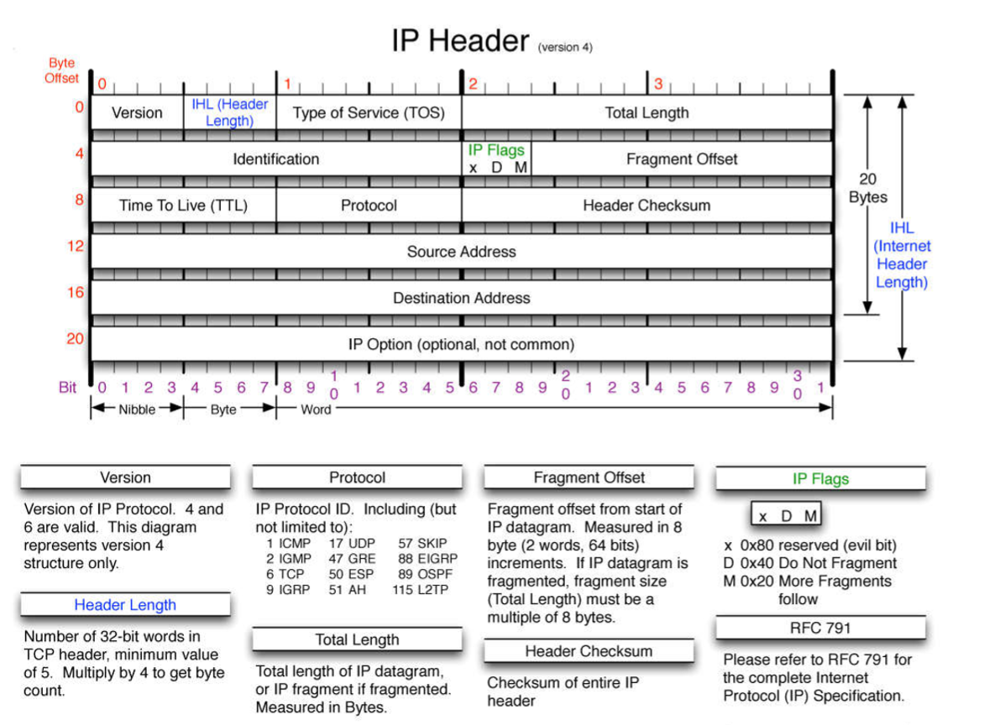
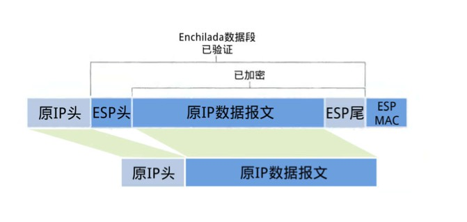
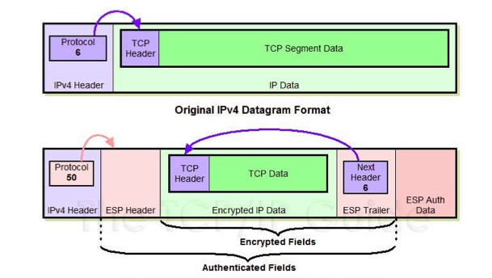
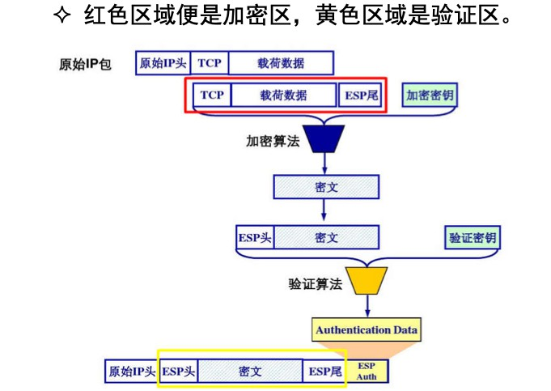

# IPSec 传输模式下 ESP 报文的装包与拆包过程


## 一、IPSec

Internet Protocol Security，是通过对IP协议（互联网协议）的分组进行加密和认证来保护IP协议的网络传输协议族。

- 每个 IP 包都得到认证、加密 
- 会话开始时建立双方的交互认证 
- 会话期间进行密钥协商
- 保护主机到主机之间，网络到网络之间，或网络到主机之间的数据流。
- 应用程序不需要专门设计，而安全套接字层（SSL），传输层安全（TLS）和安全外壳（SSH），则依靠更高层的TCP（OSI的第四层）来管理可靠性和分片。必须将TLS / SSL的使用设计到应用程序中以保护应用程序协议。


## 二、加密方式

- 传输模式：对 IP 协议报文的有效数据载荷 (payload) 进行了加密，新的IP头并不会被生成，而是采用原来的IP头，保护的也仅仅是真正传输的数据，因此需要对原始 IP报文进行拆装。
- 隧道模式：对整个 IP 报文进行加密，就好像整个 IP 报文封装在一个安全的隧道里传输一样，保持了原始IP报文的完整性。


## 三、传输模式下的ESP包

IPsec 支持两类协议：AH (Authentication Headers) 和 ESP，其中ESP (Encapsulating Security Payloads) 协议可以：

- 完整性度量
- 来源认证
- 防止回放保护
- 加密

其限制条件为：

- 完整性检查和认证一起进行
- 仅当与完整性检查和认证一起时才能选择防止回放保护
- 防止回放保护只能由接收方选择。
- 启用加密，则也就同时选择了完整性检查和认证


接下来说一下在传输模式下的具体实现

IP报文首部

```c
typedef struct _iphdr // IP 首部, 20 bytes 
{ 
	unsigned char ver-hlen //4位 IP 版本号+4位首部长度 (unit: 4-byte) 
	unsigned char TOS; //8位服务类型 TOS = PPPDTRC0 
	unsigned short pkt_len; //16位总长度 (unit: 1byte), max = 65535 
	unsigned short id; //16位分片标识符 (同一分片具有相同标识) 
	unsigned short flgs-offset; //3位分片标记+13位偏移值 
	unsigned char TTL; //8位 IP 包生存时间, 每跳减1, TTL=0 时丢弃 
	unsigned char proto; //8位上层 (封装) 协议号: 1-ICMP, 2-IGMP, 
    					 					//6-TCP, 17-UDP, 88-IGRP, 89-OSPF 	
    unsigned short hchecksum; //16位 IP 首部校验和, 每跳必算 
    unsigned int src_IP; //32位源 IP 地址 	
    unsigned int dst_IP; //32位目的 IP 地址 
} IP_HEADER;
```




传输模式下，ESP包大致结构



详细结构




### 装包过程

1、在原IP报文末尾添加尾部（ESP trailer）信息。尾部包含三部分：

- Padding，由于所选加密算法可能是块加密，那么当最后一块长度不够时就需要进行填充。

- Pad length，方便拆包时找出用来填充的那一段数据。

- Next header，被加密的数据报文的类型，即IP header中的上层协议，例如TCP。


2、将原IP报文的payload (有效载荷）以及第1步得到的ESP尾部作为一个整体进行加密。具体的加密算法与密钥由SA给出。

SA(Security Associations 安全关联)介绍：

-  IPsec 保护的某个连接的唯一标示。
- 单向的，在一次安全的通信中，通信的双方各需要创建一个 SA。 
- 一个 SA 所包含的内容是维护一次安全通信所需要的数据参数。
- 由目的地址、IPsec 所采用的协议 (AH或ESP)和 SPI 来唯一确定。 
- 所有的 SA 都被存放在一个数据库中，称为 SAD。 
- SA 的建立和维护通过密钥交换协议 IKE(Internet Key Exchange 互联网密钥交换协议) 实现，默认情况下，IPsec 使用 IKE 自动管理密钥，也可以直接手动管理。


SAD(Security Associations Database 安全关联数据库)介绍：

- 每一个 SA 在SAD 中都会有一个与之对应的条目，保存SA的信息。

| SAD 条目字段                                                 | 解释                                                         |
| ------------------------------------------------------------ | ------------------------------------------------------------ |
| 顺序号计数器（Sequence number counter for outbound communications） | 在 AH 或 ESP 的头部，占32比特。SA 初次建立时置0， 每发送一个数据包加1 |
| 顺序号溢出计数器 （Sequence number overflow counter）        | 用来标志这个 SA 是否应被弃用。如果顺序号已经溢出 ，当前的 SA 就应该被抛弃，否则会使得重放攻击成为可能 |
| 防止回放窗口 （Anti-replay Window）                          | 占32比特。与 TCP 窗口的概念类似，引进窗口的原因是 为了实现可靠的传输服务 |
| SA 有效期 （Lifetime of the SA）                             | 通过字节计数 (byte count) 或时间帧 (time frame) 或两者 的结合来记录一个 SA 的使用时间。若两者一起使用的 话，以先到期限的那一个为准。当 SA 使用了一段时间 后就应该被删除以确保安全 |
| AH 协议中所使用的算法以及密钥                                | 默认情况下，IPsec 至少 要支持 HMAC-MD5 和 HMAC-SHA，算法需要密钥支持 |
| ESP 协议用于认证以及完整性度量的算法以及密钥                 | 如HMAC是密钥相关的哈希运算消息认证码，它可用于同时验证数据完整性和消息验证。任何加密哈希函数，如MD5或SHA-1，都可用于计算HMAC;因此，所得到的MAC算法被称为HMAC-MD5或HMAC-SHA1 |
| ESP 协议用于加密数据的算法以及密钥                           |                                                              |
| IPsec 运行的模式                                             | 传输模式 (transport mode) 或者是隧道模式 (tunnel mode)       |
| PMTU (Path Maximum Transmission Unit)                        | 由 SA 的 ICMP 数据获得。MTU 值是传送数据包大小的最大上限，PMTU 是两个通信设备间的 MTU |


3、为第2步得到的加密数据添加ESP头部。 ESP头由两部分组成，SPI和序号（Sequence number）。加密数据与ESP头合称为“enchilada”。

SPI (Security Parameter Index 安全参数索引)：用于将收到的 IPsec 数据包与其对应的 SA 进行关联。

​	

 4、附加完整性度量结果（ICV，Integrity check value）。即对第三步得到的“enchilada”做摘要，得到一个完整性度量值用于验证（ESP authentication Data），并附在ESP报文的尾部。


5、拿到原本的IP头，其协议号改成50（ESP）。这样就可以发送了。

总体过程：




### 拆包过程

1、在收到数据报文后，查看IP首部发现协议类型是50，故知道这是一个IPsec包。然后查看ESP头， 通过里面的SPI决定数据报文所对应的SA，用于获得加密和HMAC算法等安全参数。

2、计算“enchilada”部分的摘要，与附在末尾的ICV做对比，如果一样的话说明数据是完整的。

3、检查Seq里的顺序号，保证数据是新的，避免重放攻击

4、解密，根据SA所提供的加密算法和密钥，解密被加密过的数据，即“enchilada”。得到原IP报文的payload与ESP尾部（trailer）。

5、去尾部，根据ESP尾部里的填充长度信息，找出填充字段的长度，删去填充字段后得到原来的payload。

6、直接交付给上层协议，如TCP或 UDP，由它们对这个包进行处理。


总的看来，ESP实现以下数据保护的方式为：

- 完整性度量（enchilada的消息摘要）
- 来源认证（同上利用HMAC）
- 防止回放保护（ESP头部的序号）
- 加密（根据SPI得到相应的SA，根据其中的参数进行加解密）


参考：

- 课件
- https://www.cnblogs.com/2014-cjs/p/4068923.html


